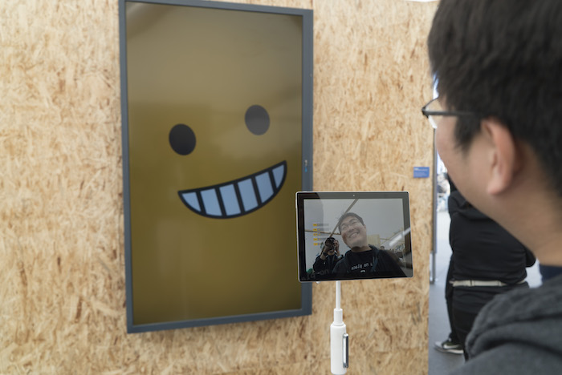

# Giant Emoji

Giant Emoji is an experimental [openFrameworks](http://openframeworks.cc/) application that translates your facial expressions into a giant emoji. It was created over a three week sprint and debuted at [Google I/O 2016](https://events.google.com/io2016/). We thought it might be fun for an attendee to turn their face into an emoji. So, we set out to figure out how to make that happen. This is the result.

## How it works

The app is running several algorithms to detect facial landmarks, and run sentimental analysis on these. The openFrameworks app delivers these landmark points and sentimental analysis results via JavaScript injection into a local WebView and/or over WebSockets to a remote browser, ready for HTML5 canvas animation. 

Within a local WebView or remote browser a [Paper.js](http://paperjs.org/) app creates the persistent emoji vector objects for animation upon initialization. A lightweight JavaScript animation loop parses the incoming JSON facial landmarks and models the corresponding X/Y coordinates, viewable in debug mode. The landmarks and confidence scores are then translated into preset emoji models (such as kissy face, cheesy smile, etc.), augmented by live expressions like mouth shape or lip geometry.

Giant emoji was created specifically for and debuted at [Google I/O 2016](https://events.google.com/io2016/).
Being a multithreaded, processor intensive application we engineered it for the [Google Pixel C](https://pixel.google.com/pixel-c/) and can guarantee performance only on that device.

This application was developed in two parts: the Android openFrameworks app that handles the face detection (written in C++), and the Web app to render the emoji (written primarily in JavaScript). 

## Android openFrameworks app 
Application is located in the `gmojiAndroid` subfolder. To build, open the folder in Android Studio 2, and press build. If dependencies are installed correctly, it should build immediately. 

The app is running several processes that are all used to generate the final emoji.

- The [ofxFaceTracker2](https://github.com/halfdanj/ofxfacetracker2) openFrameworks addon uses the device’s front-facing camera feed to detect and track 68 facial landmarks using the computer vision library [dlib](http://dlib.net/). This is happening on a background thread inside `LandmarkTracker.cpp`. 

- Inside the addon [ofxAndroidMobileVision](https://github.com/halfdanj/ofxandroidmobilevision), Google’s [Mobile Vision API](https://developers.google.com/vision/) is used to detect eye blinks and issues a blink confidence score per eye. This happens inside `ofApp.cpp`, and is running at a low frequency. 

- A custom trained dlib support vector machine model handles smile detection and yields a smile confidence score. These three confidence scores are included in the injected data. The trained models are stored in `gmojiAndroid/svmModel/`

- All the data is being lowpass filtered using [ofxBiquadFilter](https://github.com/dzlonline/ofxBiquadFilter)

### Dependencies
App was developed in a special fork of openFrameworks with improved Android Studio support available [here](https://github.com/halfdanj/openframeworks/tree/gradle-experimental) (tested in [#1e29e40](https://github.com/HalfdanJ/openFrameworks/commit/1e29e40d05c06b825eb5e75a82cd142c391142f4)). See [this](https://github.com/HalfdanJ/openFrameworks/blob/gradle-experimental/docs/android_studio.md) guide for setup. The fork is meant to eventually be merged into official 0.10.0 release. 

After openFrameworks has been properly setup, the following addons are required. The addons should be installed by cloning into `OF_ROOT/addons`

  - [ofxCv](https://github.com/kylemcdonald/ofxCv)
  - [ofxFaceTracker2](https://github.com/halfdanj/ofxfacetracker2) - run `download-model.sh` once installed to download required data model 
  - [ofxAndroidMobileVision](https://github.com/halfdanj/ofxandroidmobilevision)
  - [ofxBiquadFilter](https://github.com/dzlonline/ofxBiquadFilter)

## Web app
For best performance the Web app ought to be run on a remote machine using a simple [Node.js](https://nodejs.org) server. Navigate to `gmojiWeb/nodejs` from the command line, run `npm install` to perform an initial setup, then run `npm run start` to start the webserver. Once the server is running you will be able to point your Web browser to [http://localhost:3000/](http://localhost:3000/).

Inside the Android app, double-tap the top-left corner to access Settings and type in the IP address of the remote machine including `http://` and the trailing port number `:3000`. This will allow the Android app to stream the JSON package over [Socket.IO](http://socket.io/) to your remote machine. Alternatively, the Web app can be hosted directly on-device using the Android app’s built-in WebView. Note: doing so carries a performance penalty and therefore is primarily for debugging purposes. (This view can also be toggled in the Android app’s Settings).
